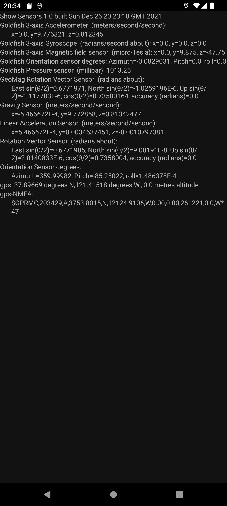


## ShowSensors

This is a simple app which finds all the sensors on the device and reports their values. Most sensors are updated every second. If the device has a GPS sensor, the coordinates are updated when they change, but not more often than once per second. NMEA messages, if supported, are displayed when they arrive, but again not more often than one new message per second.

The GPS can have trouble getting started up: the NMEA messages if supported will appear anything up to about a minute before the processed GPS data. If it keeps saying "no messages yet" for longer than that, try moving the device about a bit, or quitting and restarting the app.

ShowSensors is open source, free, and does not display adverts or pester you for a donation. This will never change as long as I am maintaining it.

The output on the screen looks like this:-

## Signing and saving settings

Newer versions of Android do not allow you to install unsigned applications. The `.apk` file in the git release is signed (with my signing key). Naturally I am not willing to publish my signing key, so if you build your own version you will need to to sign it with your own signing key. The `app/build.gradle` file expects a `keystore.properties` file in the `Keys` subdirectory of the parent directory of project root directory, which you will need to fill with the details of your own signing key. You can find how to create it [here](https://developer.android.com/studio/publish/app-signing.html).

## Permissions

ShowSensors requests the following permissions:-

ACCESS_FINE_LOCATION and ACCESS_COARSE_LOCATION
These are needed to enable ShowSensors to monitor the GPS sensor. ACCESS_FINE_LOCATION used to imply ACCESS_COARSE_LOCATION, but more recent versions of Android need both. If ShowSensors doesn't have the permissions, it will show "Permission denied" instead of the GPS data.

ACTIVITY_RECOGNITION
This is needed for the step counter if your device has one.  If ShowSensors doesn't have the permission, it will show "Permission denied" instead of the step count.

BODY_SENSORS
This is needed for the heart rate sensor if your device has one. If ShowSensors doesn't have the permission, it will show "Permission denied" instead of the heart rate.

Your device might have sensors requiring other permissions. Some devices have sensors with vendor-private permissions which it doesn't seem to be possible to grant.

#### What can I legally do with this app ?

This application is released under the GNU GPL v3 or later, do make sure you abide by the license terms when using it.
Read the license terms for more details, but to make it very (too) simple: you can do everything you want with the application, as long as you provide your source code with any version you release, and release it under the same license.
